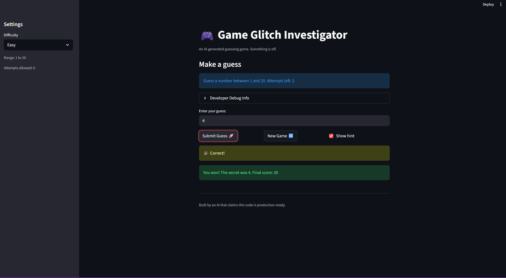

# 🎮 Game Glitch Investigator: The Impossible Guesser

## 🚨 The Situation

You asked an AI to build a simple "Number Guessing Game" using Streamlit.
It wrote the code, ran away, and now the game is unplayable. 

- You can't win.
- The hints lie to you.
- The secret number seems to have commitment issues.

## 🛠️ Setup

1. Install dependencies: `pip install -r requirements.txt`
2. Run the broken app: `python -m streamlit run app.py`

## 🕵️‍♂️ Your Mission

1. **Play the game.** Open the "Developer Debug Info" tab in the app to see the secret number. Try to win.
2. **Find the State Bug.** Why does the secret number change every time you click "Submit"? Ask ChatGPT: *"How do I keep a variable from resetting in Streamlit when I click a button?"*
3. **Fix the Logic.** The hints ("Higher/Lower") are wrong. Fix them.
4. **Refactor & Test.** - Move the logic into `logic_utils.py`.
   - Run `pytest` in your terminal.
   - Keep fixing until all tests pass!

## 📝 Document Your Experience

- [X] Describe the game's purpose.
This game's purpose is to guess the hidden value, and the game provides hints as to whether you should guess higher or lower.
- [X] Detail which bugs you found.
I found bugs relating to the difficulty range (whether the number should be between 1 and 20 vs 1 and 50 vs 1 and 100) as well as bugs relating to the guessing logic (where odd type casting led to issues of identifying whether the guess was higher or lower than the actual value).
- [X] Explain what fixes you applied.
I corrected the difficulty range as well as removed the odd type casting and added tests in a pytest suite relating to both bug fixes.

## 📸 Demo

- [X] [Insert a screenshot of your fixed, winning game here]

## 🚀 Stretch Features

- [ ] [If you choose to complete Challenge 4, insert a screenshot of your Enhanced Game UI here]
