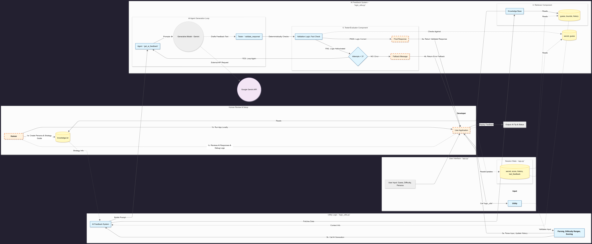
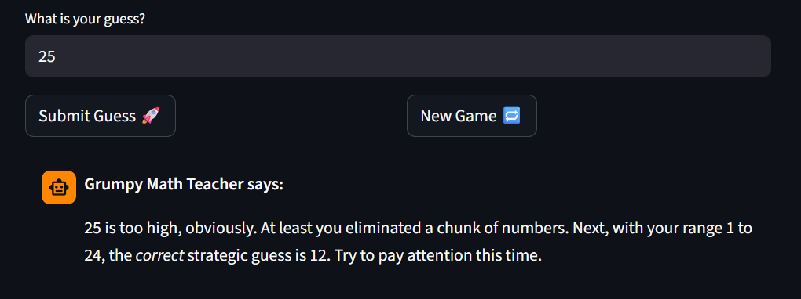
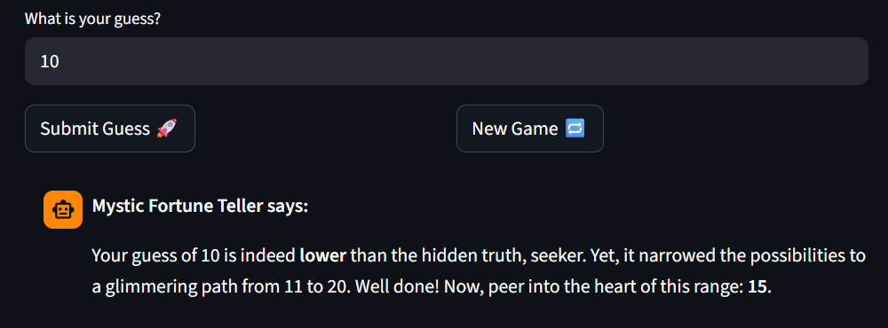

# Title: Persona Guesser

## Summary

This project is a number-guessing game that gives AI-generated clues to the user, with the ability to choose different personas to give the clue. This project matters because it utilizes RAG by retrieving a document on the binary search algorithm, which is a great strategy that the AI can then use to give hints to the user. The AI responses are also validated for ensuring the direction of the clue (higher vs. lower) is accurate.

## Original/Base Project

The original game was the Module 1 Game Glitch Investigator project. Its original goal was to design a game that allowed a user to guess a number at certain difficulty levels, and provide the user hints as to how to change their guess to get the final correct answer. It originally used deterministic coding to produce the hint and also had a test suite to ensure the correct hints were given.

## Architectural Overview

The user starts the application by running the app locally. The user application utilizes parsing logic as well as various session state items to keep track of what the user submits and the current state of the game. The user's guess history, the knowledge.txt file (contains information on binary search), and the Google Gemini model all feed into the AI feedback system, which is run through validation logic to ensure the clues provided are reasonable. These responses are then used by the user application.

## Setup Instructions

1. Install dependencies: `pip install -r requirements.txt`
2. Rename .env.example to .env
3. Generate a Gemini API Key and copy the key into the .env file
4. Run the app: `python -m streamlit run app.py`

## Sample Interactions

After starting up the app, and using the settings Difficulty=Normal and Persona=Grumpy Math Teacher, when the first guess of 25 is provided, the AI will say that the guess did effectively eliminate a large chunk of numbers (this demonstrates that the AI recognizes the user is aligning with the binary search strategy). And then depending on the random number that is the answer, the AI in the first sentence will say if the guess was too high, too low, or correct. The tone of the response also should seem grumpy.

Now use the settings Difficulty=Easy and Persona=Mystic Fortune Teller, and start a new game. When the first guess of 10 is provided, the AI will say that the guess did effectively eliminate a large chunk of numbers (this demonstrates that the AI recognizes the user is aligning with the binary search strategy). And then depending on the random number that is the answer, the AI in the first sentence will say if the guess was too high, too low, or correct. The tone of the response also should seem mystic/mysterious/magical.

## Design Decisions

I choose to implement RAG by having a simple text file that describes a good strategy for playing the game, the binary search algorithm. A tradeoff of this is that I only ever provide one strategy, which means there is less flexibility for the user. But I think keeping the model simple allows for the scope to be more focused, and easier to see if the model is following the recommended strategy hints.

I used the Gemini API because we had previously worked with the API in a tinker activity, so I had familiarity with how to make the appropriate API calls.

## Testing Summaries

I included a validation step in the process as a form of testing, where if the lower/higher recommendation of the AI was inaccurate, it printed out an error message alerting the user to the issue. Additionally, there is a certainty score based on this validation included.

I did ten rounds of manual testing, with a pass defined as the error message from the validation test not appearing. 10/10 tests passed, showing that the AI model was making the correct recommendations.

## Reflection

While the numerical clues given by the AI are less likely to be limited/biased, as they are validated, the personas of the AI have the possibility of being stereotypical representations of those occupations. It is possible, without proper parsing logic of the user input, that a user could create malicious prompts to send to the AI model, but I do do some basic parsing which guards against this. I was surprised about the AI's difficulty in providing helpful clues that still maintain a fun persona. For example, the AI gave flawed help by giving an accurate range too "early"- it couldn't tell the first time that the hint was giving information away. But AI was great as a development tool for this project, as I am still very new to streamlit apps and relied on it for all the UI change.

## Walkthrough

